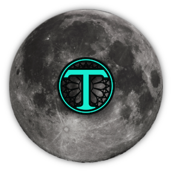

# MoonTrace

## Information
* A MoonScript/ Lua port of [Tracery](http://tracery.io) ([GitHub](https://github.com/galaxykate/tracery/tree/tracery2)). 
* Tracery is a story-grammar generation library for JavaScript
* This is a complete rewrite, but the API should be functionally identical  
* Uses context-free languages for the grammar and seeded RNG to construct procedural text

## Documentation
For learning how Tracery grammars work in general, visit this [tutorial](http://www.crystalcodepalace.com/traceryTut.html).  
More in-depth docs can be found on the [Tracery site ](http://tracery.io) or its [GitHub repo](https://github.com/galaxykate/tracery/tree/tracery2).

## Use cases
Use it to generate any kind of text or images (or music or whatever) that you could also generate with Tracery. Have fun with the C++ API for Tracery grammars.
The project [QuestGen](http://github.com/lemilonkh/questgen) is supposed to be compiled with TraceryCpp instead of the JavaScript version in the future.  
Use the [Tracery visual editor](http://www.brightspiral.com/tracery/) to easily edit and create Tracery grammars with a live preview.

## Installation
1. Clone this repository
2. Install [LuaRocks](https://github.com/luarocks/luarocks/wiki/Download) and [MoonScript](http://moonscript.org)

